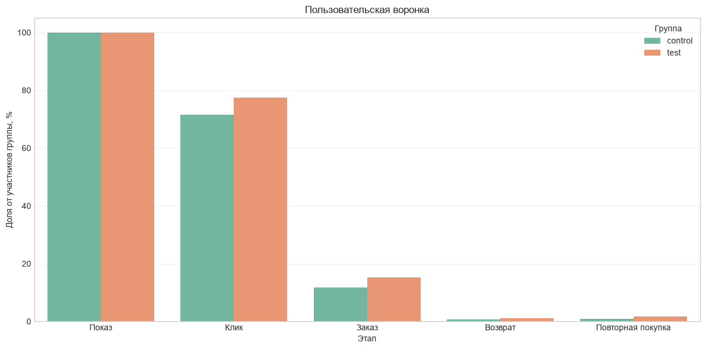
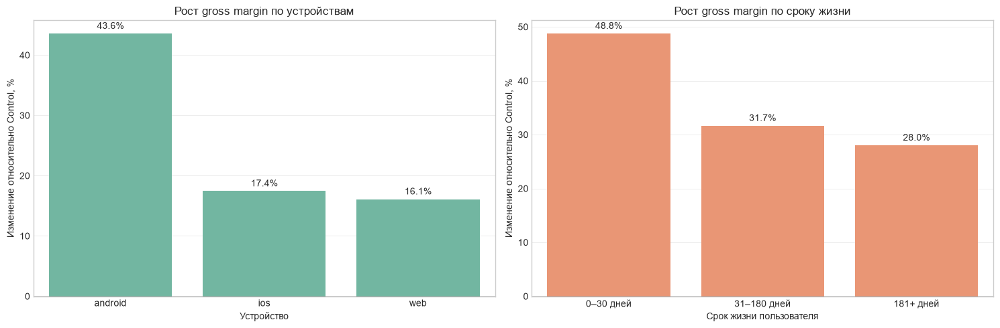
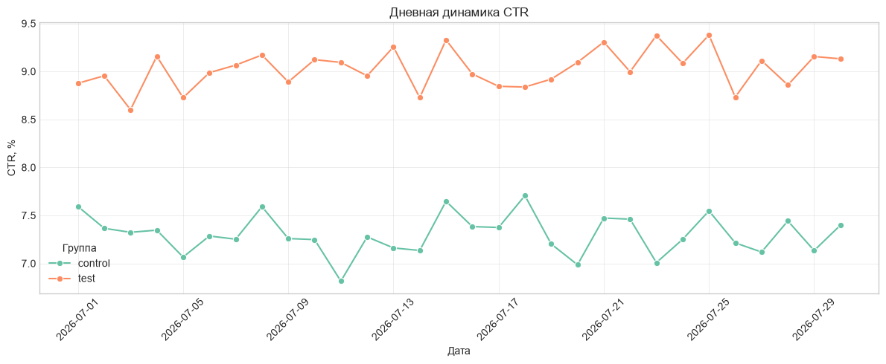

# A/B-тест рекомендательной модели маркетплейса

Продуктовое исследование результатов 30-дневного A/B-теста новой AI-модели рекомендаций: от проверки качества данных до статистических выводов и стратегии внедрения.

## Краткий вывод

Новая модель статистически значимо увеличила конверсию в покупателя, количество заказов, GMV и gross margin на пользователя. Одновременно выросли Return Rate и обращения в поддержку, а маржинальность одного заказа немного снизилась.

**Рекомендация:** внедрять модель поэтапно, сохранить постоянную контрольную группу и усиленно контролировать возвраты, поддержку и удельную экономику заказа.



## Бизнес-задача

Определить, следует ли масштабировать новую рекомендательную модель на всю аудиторию маркетплейса.

- **Control** — старая рекомендательная система.
- **Test** — новая AI-модель.
- **Продолжительность** — 30 дней.
- **Единица рандомизации** — пользователь.
- **Размер очищенной выборки** — 49 301 пользователь.

## Ключевые результаты

| Метрика | Control | Test | Эффект Test − Control |
|---|---:|---:|---:|
| Пользовательский CTR | 7,53% | 9,32% | +1,80 п.п. |
| Конверсия в покупателя | 11,77% | 15,14% | +3,37 п.п. |
| Заказы на пользователя | 0,13 | 0,17 | +33,76% |
| GMV на пользователя | 209,80 ₽ | 285,58 ₽ | +36,12% |
| Gross margin на пользователя | 34,96 ₽ | 46,14 ₽ | +31,96% |
| Пользователи с возвратом | 0,70% | 1,15% | +0,45 п.п. |
| Пользователи с обращением | 0,54% | 0,81% | +0,27 п.п. |

Все десять проверенных продуктовых и бизнес-метрик сохранили статистическую значимость после FDR-коррекции множественных проверок.

## Ожидаемый эффект на 100 тысяч пользователей

При линейном переносе результатов эксперимента на 100 тысяч пользователей ожидаемый 30-дневный эффект составляет приблизительно:

- **+3 368 покупателей**;
- **+4 274 заказа**;
- **+7,58 млн ₽ GMV**;
- **+1,12 млн ₽ gross margin**;
- **+798 повторных покупателей**;
- **+453 пользователя с возвратом**;
- **+274 пользователя с обращением в поддержку**.

Среди 100 тысяч пользователей без Premium на старте ожидается около **546 дополнительных Premium-конверсий**.

Оценка является линейной экстраполяцией результатов 30-дневного эксперимента, а не гарантированным прогнозом.

## Основной бизнес-компромисс

Test создал больше покупателей и заказов, поэтому суммарные GMV и gross margin существенно выросли. Однако экономика отдельного заказа не улучшилась:

| Метрика заказа | Control | Test |
|---|---:|---:|
| Average Order Value | 1 657,37 ₽ | 1 686,57 ₽ |
| Gross margin на заказ | 276,18 ₽ | 272,47 ₽ |
| Return Rate | 5,55% | 6,85% |
| Gross margin rate | 16,66% | 16,16% |

Рост общей маржи обеспечивается преимущественно дополнительным объёмом заказов. Цена роста — больше возвратов, обращений в поддержку и небольшое снижение удельной маржинальности.

## Сегментационный анализ

Наиболее сильный пользовательский эффект наблюдается:

- на **Android**: gross margin на пользователя +43,58%;
- среди пользователей со сроком жизни **0–30 дней**: +48,76%;
- в категории **Electronics**: +42,24% при снижении Return Rate.

Наиболее благоприятное сочетание роста и риска наблюдается в Electronics, Pet и FMCG. В Fashion и Sports рост маржи сопровождается увеличением Return Rate на 3,87 и 3,39 п.п. соответственно.

Web оказался наименее убедительным пользовательским сегментом: наблюдаемый рост gross margin положительный, но статистически не подтверждён на уровне значимости 5%.



## Устойчивость эффекта

CTR Test превышал Control во все 30 дней эксперимента. Средняя разница составила:

- +1,70 п.п. в первые 15 дней;
- +1,74 п.п. в последние 15 дней.

Признаков затухания эффекта внутри экспериментального окна не обнаружено.



## Методология

1. Аудит пропусков, дубликатов, аномалий и связей между таблицами.
2. Проверка конфликтующих назначений и Sample Ratio Mismatch.
3. Формирование очищенной выборки и строгой событийной цепочки.
4. EDA и проверка баланса экспериментальных групп.
5. Пользовательская и событийная воронки.
6. Пользовательская витрина продуктовых, денежных и защитных метрик.
7. Тест разности долей для бинарных метрик.
8. T-тест Уэлча для количественных метрик.
9. 95%-е доверительные интервалы и FDR-коррекция.
10. Сегментационный анализ, оценка unit economics и план rollout.

## Работа с качеством данных

В основной анализ не включены:

- 300 пользователей с конфликтующими назначениями;
- 400 bot-like пользователей;
- один пользователь входил в обе категории исключения;
- 3 046 событий показа, отмеченных как дублирующиеся.

Дополнительно учтены пропуски стоимости доставки и возвраты после окончания 30-дневного экспериментального окна.

## Рекомендация

Не запускать модель одномоментно на 100% аудитории.

Предлагаемый подход:

1. Начать контролируемый rollout на Android.
2. Сохранить 5–10% постоянной контрольной группы.
3. Если продукт позволяет управлять выдачей по категориям, начать с Electronics, Pet и FMCG; иначе использовать категории как обязательный разрез мониторинга.
4. Отдельно контролировать Fashion, Sports и новых пользователей.
5. Мониторить Return Rate, обращения в поддержку, gross margin на заказ и gross margin rate.
6. Получить результаты на горизонте 60–90 дней перед полным запуском.

## Ограничения

- Эксперимент продолжался только 30 дней.
- 65% известных возвратов произошли после окончания экспериментального окна.
- Полная формула gross margin и состав операционных затрат неизвестны.
- Сегментационный анализ является разведочным и не заменяет тест взаимодействия.
- Категория покупки является постэкспериментальной характеристикой.
- Экстраполяция на 100 тысяч пользователей предполагает сохранение состава аудитории и эффекта модели.
- Данных недостаточно для полноценной оценки LTV и долгосрочного удержания.

## Структура репозитория

```text
marketplace-ai-ab-test/
├── README.md
├── requirements.txt
├── .gitignore
├── assets/
│   ├── funnel.png
│   ├── daily_ctr.png
│   └── segment_uplift.png
├── data/
│   └── README.md
└── notebooks/
    └── marketplace_ai_ab_test_Kolodii_Ilya.ipynb
```

## Запуск проекта

1. Клонировать репозиторий.
2. Создать и активировать виртуальное окружение.
3. Установить зависимости:

```bash
pip install -r requirements.txt
```

4. Получить исходный датасет у организаторов и разместить CSV согласно инструкции в `data/README.md`.
5. Открыть и выполнить `notebooks/marketplace_ai_ab_test_Kolodii_Ilya.ipynb`.

## Технологии

Python, Pandas, NumPy, SciPy, Statsmodels, Matplotlib, Seaborn и Jupyter Notebook.

## Автор

**Илья Колодий**  
Учебный проект по продуктовой аналитике, выполненный на датасете School of Analytics Open Hackathon 2026.

